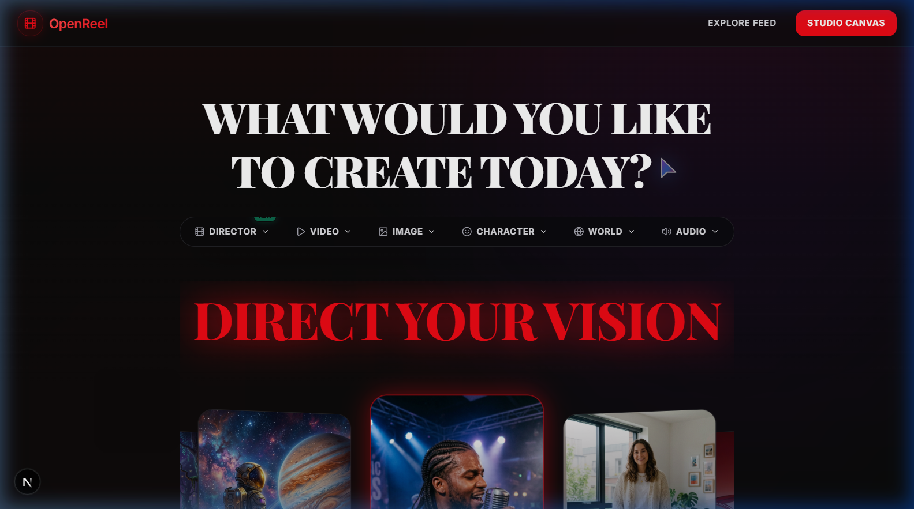
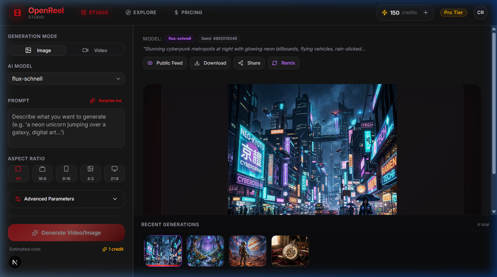

# 🎬 OpenReel: Multi-Model AI Video & Image Generation Platform

OpenReel is a state-of-the-art, full-stack creative platform designed for high-fidelity cinematic video and image generation. Combining a modern, responsive Next.js frontend with a robust FastAPI orchestration microservice, OpenReel streamlines the prompt-to-production workflow for digital creators, animators, and filmmakers.

## 🚀 Key Previews

### 🏠 Landing Page
A dark, premium, and highly aesthetic interface introducing OpenReel's capabilities, prompt options, and community creations.



### 🎨 Studio Canvas
A feature-rich designer workspace with multi-model sidebars, parametric tuning (aspect ratio, inference steps, seed, guidance scale), real-time queue rendering, and generation history.



---

## ✨ Primary Features

1. **Multi-Model Orchestration**: Select from a range of top-tier AI models, optimized for specific creative tasks:
   - **Seedance 2.0 (Fal.ai)**: High-speed, fluid cinematic video generation (Text-to-Video and Image-to-Video).
   - **Kling AI**: Production-grade cinematic video with advanced aspect ratio scaling.
   - **Google Imagen 3.0**: Photorealistic, high-resolution text-to-image synthesis.
   - **Nano Banana (Gemini 3.1 Flash Image)**: Image generation with reference image structure matching.
2. **Interactive Studio Canvas**:
   - Live settings control (aspect ratios like `16:9`, `9:16`, `1:1`, `4:3`, `21:9`).
   - Detailed generation parameters (negative prompts, inference steps, guidance scale, seed control).
   - Image reference inputs for conditioning.
3. **Cinematic Prompt Enhancement**: Integrated with **Google Gemini 1.5/3.1 Flash** to polish simple prompts into rich, cinematic descriptions before hitting heavy GPU pipelines.
4. **Real-Time Pipeline Status**: Powered by **Supabase Realtime Postgres Changes**, providing instant updates on queue positioning, GPU progress rendering, completions, and failures.
5. **Community Explore Feed & Remixing**:
   - Community-driven wall of high-fidelity generations.
   - One-click **Remixing** to pull parameters, prompts, and configurations directly into your Studio Canvas.
6. **Token-Based Billing System**:
   - Integrated with Stripe for subscription tiers (Pro, Max) and top-ups.
   - Real-time credit deduction and refund safety checks (credits are auto-refunded on model generation failure).

---

## 🏗️ Architecture & Tech Stack

### Frontend
- **Framework**: Next.js 16 (App Router, Turbopack)
- **Styling**: Tailwind CSS v4, custom utility systems
- **State & Database Sync**: Supabase SSR client, Realtime WebSockets
- **UI Components**: shadcn/ui, Lucide React icons

### Backend (Microservice)
- **Framework**: FastAPI (Python 3.10+)
- **WSGI/ASGI Server**: Uvicorn
- **Integration Clients**: Google GenAI SDK, Fal.ai Client, Kling API client
- **Database/Auth Security**: Supabase JWT authentication matching and webhook verification

---

## 🛠️ Getting Started

### 📋 Prerequisites
- **Node.js** (v18.x or later)
- **Python** (3.10 or later)
- **Supabase** account and project database
- API credentials for **Fal.ai**, **Kling AI**, and **Google Gemini**

---

### 💻 Frontend Setup

1. **Navigate to the root directory and install npm dependencies**:
   ```bash
   npm install
   ```

2. **Configure Frontend Environment Variables**:
   Create a `.env` file in the root directory (based on `.env.example`):
   ```ini
   NEXT_PUBLIC_SUPABASE_URL=https://your-project.supabase.co
   NEXT_PUBLIC_SUPABASE_ANON_KEY=your-anon-key
   NEXT_PUBLIC_APP_URL=http://localhost:3000
   NEXT_PUBLIC_API_URL=http://localhost:8000
   ```

3. **Start the Next.js Dev Server**:
   ```bash
   npm run dev
   ```
   Open [http://localhost:3000](http://localhost:3000) to view the application.

---

### 🐍 Backend Setup

1. **Activate the Virtual Environment**:
   - **Windows (PowerShell)**:
     ```powershell
     .venv\Scripts\Activate.ps1
     ```
   - **macOS/Linux**:
     ```bash
     source .venv/bin/activate
     ```

2. **Install Python Packages**:
   ```bash
   pip install -r requirements.txt
   ```

3. **Configure Backend Environment Variables**:
   Add the API keys and Supabase parameters inside your `.env` (based on `.env.example`):
   ```ini
   # API Keys
   FAL_API_KEY=your_fal_api_key_here
   GEMINI_API_KEY=your_gemini_api_key_here
   KLING_API_KEY=your_kling_api_key_here

   # Database & Middleware Config
   SUPABASE_URL=https://your-project.supabase.co
   SUPABASE_KEY=your-service-role-key
   SUPABASE_JWT_SECRET=your-supabase-jwt-secret
   WEBHOOK_BASE_URL=http://localhost:8000
   ```

4. **Start the FastAPI Microservice**:
   ```bash
   python main.py
   ```
   The backend API will start running on [http://localhost:8000](http://localhost:8000).

---

## 📊 Database Schema Setup

The database tables are built on PostgreSQL (via Supabase). Execute the migration script located in [supabase/schema.sql](file:///c:/Users/91703/OpenReel/supabase/schema.sql) using the Supabase SQL Editor.

The schema establishes:
- `profiles`: Manages user credentials, premium subscription tiers, and credit balances.
- `generations`: Keeps track of parameters, output URLs, status (pending, processing, completed, failed), and user interactions.

---

## 🔒 Security & Webhooks

- All API endpoints under `/api/v1/generate/` are secured via Supabase JWT authorization headers.
- Async GPU generation callbacks use secure, SHA256-hashed signature validation on the `/api/v1/webhooks` endpoint to ensure authentic event delivery from fal.ai and Kling networks.

---

## 📄 License
This project is licensed under the MIT License. See the LICENSE file for details.
